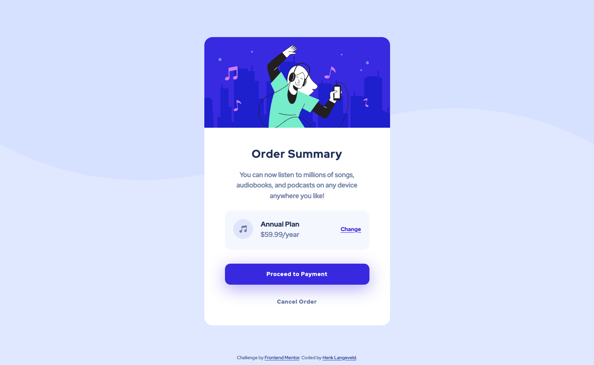
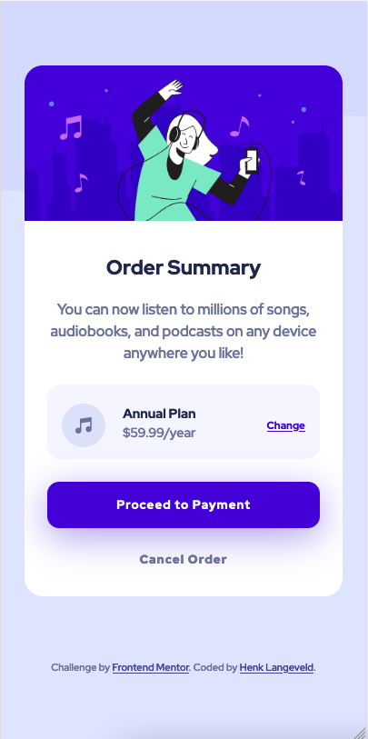

# Frontend Mentor - Order summary card solution

This is a solution to the [Order summary card challenge on Frontend Mentor](https://www.frontendmentor.io/challenges/order-summary-component-QlPmajDUj). Frontend Mentor challenges help you improve your coding skills by building realistic projects.

## Table of contents

- [Overview](#overview)
  - [The challenge](#the-challenge)
  - [Screenshot](#screenshot)
  - [Links](#links)
- [My process](#my-process)
  - [Built with](#built-with)
  - [What I learned](#what-i-learned)
  - [Continued development](#continued-development)
  - [Useful resources](#useful-resources)
- [Author](#author)
- [Acknowledgments](#acknowledgments)

**Note: Delete this note and update the table of contents based on what sections you keep.**

## Overview

### The challenge

Users should be able to:

- See hover states for interactive elements

### Screenshots

- desktop view: 
- mobile view: 

### Links

- Solution URL: [Add solution URL here](https://github.com/HenkLangeveld/order-summary)
- Live Site URL: https://order-summary-by-henk.netlify.app/

## My process

### Built with

- Semantic HTML5 markup
- SCSS custom properties
- Flexbox
- Mobile-first workflow

**Note: These are just examples. Delete this note and replace the list above with your own choices**

### What I learned

When using 2 screens and you make the window big enough, the window becomes a bit transparent when the cursor is on the other screen, but most of the window on the first screen. This can be usefull to overlay your solution on the design svg.

I had trouble with the background image. Eventually I found that the path for my main.css is one level deeper than the main.scss. Therefore the background image could not be found.

I've used a lot of dimensions with using px and doing so for each separate occasion. I would much rather use rem or em, but with this challenge this was easier.

### Useful resources

- [Example resource 1](https://medium.com/@brianhan/watch-compile-your-sass-with-npm-9ba2b878415b) - This helped me setup my SCSS. I really liked this pattern and will use it going forward.

## Author

- Website - [Henk Langeveld](https://www.henklangeveld.com/)
- Frontend Mentor - [@HenkLangeveld](https://www.frontendmentor.io/profile/HenkLangeveld)
